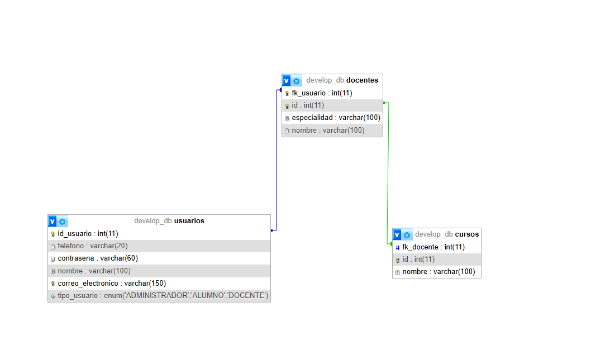

# Examen1Back2 — README (corregido y documentado)

Backend educativo con **Spring Boot 3**, **Java 17**, **JPA/Hibernate** y **MySQL (XAMPP)**.  
Modela **Usuario**, **Docente** y **Curso** y sus relaciones.

> Proyecto académico. Documento elaborado con apoyo de IA para registrar el proceso y las correcciones.

---

## 1) Descripción del proyecto
API de ejemplo para gestionar docentes y cursos. Contiene:
- **Usuario**: credenciales y datos de contacto, con un `TipoUsuario` (enum).
- **Docente**: datos del profesor y enlace 1:1 con `Usuario`.
- **Curso**: cursos dictados por un `Docente` (1:N).

**Relaciones**
- `Docente (1) — (N) Curso`
- `Docente (1) — (1) Usuario` (Docente **posee la FK** `fk_usuario`).

Paquete de entidades: `com.example.Examen1Back2.modelos`

---

## 2) Stack y requisitos
- Java **17** (obligatorio para Spring Boot 3)
- Spring Boot (**Web**, **Data JPA**)
- MySQL/MariaDB con **XAMPP**
- Gradle Wrapper (incluido)

---

## 3) Estructura del proyecto
```
src/
  main/
    java/com/example/Examen1Back2/
      modelos/ (Usuario, Docente, Curso, TipoUsuario)
      Examen1Back2Application.java
    resources/
      application.properties
build.gradle
settings.gradle
```

---

## 4) Guía paso a paso — Conexión a MySQL (XAMPP)
1. Inicia **MySQL** en XAMPP (Running) y abre **http://localhost/phpmyadmin**.
2. Crea la base:
   ```sql
   CREATE DATABASE develop_db CHARACTER SET utf8mb4 COLLATE utf8mb4_unicode_ci;
   ```
3. Configura `src/main/resources/application.properties` **(primera ejecución)**:
   ```properties
   spring.application.name=Examen1Back2
   spring.datasource.url=jdbc:mysql://localhost:3306/develop_db?useSSL=false&allowPublicKeyRetrieval=true&serverTimezone=UTC
   spring.datasource.username=root
   spring.datasource.password=
   spring.datasource.driver-class-name=com.mysql.cj.jdbc.Driver

   # Solo la primera vez para que cree tablas automáticamente:
   spring.jpa.hibernate.ddl-auto=create
   spring.jpa.show-sql=true
   spring.jpa.properties.hibernate.format_sql=true
   ```
4. Arranca la app y verifica que se crean las tablas en `develop_db`.  
   Luego cambia a:
   ```properties
   spring.jpa.hibernate.ddl-auto=update
   ```

---

## 5) Ejecutar
Con **Gradle Wrapper**:
```bash
# Windows
gradlew.bat bootRun
# macOS / Linux
./gradlew bootRun
```
La app inicia en `http://localhost:8080`.

Construir JAR:
```bash
gradlew.bat bootJar   # o ./gradlew bootJar
java -jar build/libs/Examen1Back2-0.0.1-SNAPSHOT.jar
```

---

## 6) Registro de cambios (antes → después, con líneas de referencia)
> Las líneas corresponden a tus capturas actuales y pueden variar ±1 si agregas espacios/comentarios. Usa **Ctrl+G** en IntelliJ para ir a la línea.

### 6.1 `Curso.java`
**Estado actual (según captura):**
- `@Id` **L11**, `@GeneratedValue` **L12**
- `@Column(nombre)` **L14**
- `@ManyToOne` **L17**, `@JoinColumn` **L18**, `@JsonBackReference("docente-curso")` **L19**
- `private Docente docente;` **L20**

**Errores originales y corrección aplicada**
- **L8–9**: `@I` y `@Ge(strategy = IDENTITY)` → **`@Id`** y **`@GeneratedValue(strategy = GenerationType.IDENTITY)`** (L11–12).
- **L15**: `@JoinColumn(...);` con **;** → **sin `;`** (L18) + se añadió `@ManyToOne(fetch = FetchType.LAZY)` (L17).
- **L16**: `Docente docente` sin `;` / sin `private` → **`private Docente docente;`** (L20).
- Se añadió `@Table(name="cursos")` y restricciones de `@Column` para `nombre` (L14).

---

### 6.2 `Docente.java`
**Estado actual (según captura):**
- `@Entity` sobre la clase (**L8 aprox.**) y `@GeneratedValue` **L10** (acompañado de `@Id`)
- `@OneToMany(mappedBy="docente")` + `@JsonManagedReference("docente-curso")` **L17–19**
- `@OneToOne` + `@JoinColumn(name="fk_usuario", referencedColumnName="id_usuario")` + `@JsonManagedReference("docente-usuario")` **L21–23**
- `private Usuario usuario;` **L24**

**Errores originales y corrección aplicada**
- **L6**: `@Entit` (tipografía) → **`@Entity`**.
- Faltaba `@Id` (PK) → se agregó junto a `@GeneratedValue(strategy = GenerationType.IDENTITY)` (L9–10).
- No existía relación **1:N** con `Curso` → **agregada** (L17–19) con `mappedBy="docente"`.
- No existía relación **1:1** con `Usuario` (dueño) → **agregada** (L21–24) con `@JoinColumn("fk_usuario")`.
- Campos `nombre`/`especialidad` con `@Column(...)`.

---

### 6.3 `Usuario.java`
**Estado actual (según captura):**
- `@Entity` (**L6 aprox.**); `@Id` **L9**, `@GeneratedValue` **L10**, `@Column(name="id_usuario")` **L11**
- `@Column(nombre)` **L13**
- `@Column(correoElectronico, unique=true)` **L16**
- `@Column(contrasena)` **L19** (sin ñ)
- `@Enumerated(EnumType.STRING)` **L22** + `TipoUsuario tipoUsuario` **L23**
- `@OneToOne(mappedBy="usuario")` + `@JsonBackReference("docente-usuario")` **L27–29**
- `private Docente docente;` **L30**

**Errores originales y corrección aplicada**
- **L6**: `@Entit` (tipografía) → **`@Entity`**.
- Faltaba `@Id` → **agregado** (L9–11 con `@Column(name="id_usuario")`).
- `@Colun(name="correo_electronico")` mal escrito → **`@Column(name="correo_electronico", unique = true)`** (L16) o campo camelCase `correoElectronico`.
- `contraseña` con **ñ** → **renombrado** a `contrasena` (L19).
- Faltaba el lado inverso **1:1** → **`@OneToOne(mappedBy="usuario")`** + `@JsonBackReference("docente-usuario")` (L27–30).

---

### 6.4 `TipoUsuario.java`
- No existía → creado `public enum TipoUsuario { ADMINISTRADOR, DOCENTE, ALUMNO }`.

---

### 6.5 `application.properties`
**Antes (captura):**
```properties
spring.application.name=Examen1Back2
spring.datasource.url=jdbc:mysql://localhost/develop_db
spring.datasource.username=root
spring.datasource.password=
spring.jpa.hibernate.ddl-auto=create
```
**Después (recomendado):**
```properties
spring.application.name=Examen1Back2
spring.datasource.url=jdbc:mysql://localhost:3306/develop_db?useSSL=false&allowPublicKeyRetrieval=true&serverTimezone=UTC
spring.datasource.username=root
spring.datasource.password=
spring.datasource.driver-class-name=com.mysql.cj.jdbc.Driver

# Primera vez para crear tablas automáticamente:
spring.jpa.hibernate.ddl-auto=create
spring.jpa.show-sql=true
spring.jpa.properties.hibernate.format_sql=true
```
> Tras la primera ejecución, cambia `ddl-auto` a **`update`**.

---

## 7) Recomendaciones para evitar errores similares
- Usar **Java 17** y paquetes **jakarta.*** en Spring Boot 3.
- Evitar caracteres especiales en nombres (ej.: `contrasena` en lugar de `contraseña`).
- No terminar anotaciones con `;` (ej.: `@JoinColumn`).
- Definir relaciones en **ambos lados** cuando aplique: `mappedBy` en el inverso, `@JoinColumn` en el dueño.
- Controlar el `fetch` (por defecto LAZY para `@ManyToOne`).
- Empezar con `ddl-auto=create` solo la primera vez; luego `update`.
- Mantener un **.gitignore** para `/build`, `.gradle`, `.idea`, etc.

---

## Evidencias

1. **XAMPP con MySQL RUNNING**  
   

2. **phpMyAdmin: base `develop_db` creada**  
   

3. **`application.properties` configurado**  
   

4. **Consola: `gradlew bootRun` exitoso**  
   

5. **Tablas creadas (`usuarios`, `docentes`, `cursos`)**  
   


---

## 9) Versionamiento (sugerencia)
```bash
git add .
git commit -m "docs: README corregido y registro de cambios"
git push
```
